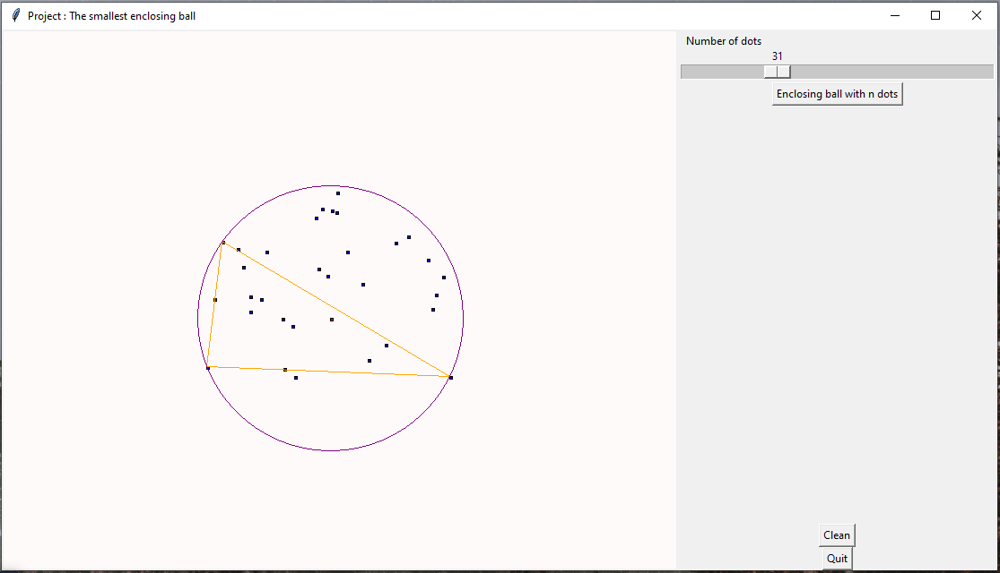

# Smallest-enclosing-ball

__School Project (2017) :__ Interface using Tkinter with Python showing a naive approach to solve the smallest enclosing circle. There is 2 cases :
  - Trace the circle using the diameter (2 dots).
  - Trace the circle using a obtuse or acute triangle (3 dots).
  

__Afterthought (2020) :__ One big improvement for better readability of the algorithm is to use python classes and create dot, triangle and circle class.
